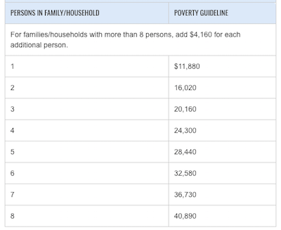
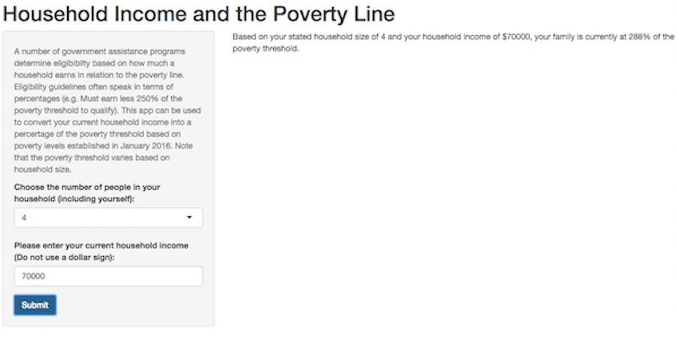

## What is the poverty threshold?

In the United States, the federal government calculates an annual "poverty threshold" which is designed to estimate the annual household income needed to provide for a family's basic needs.  Because more family members require more money to meet those needs, the poverty threshold is higher for families with more members. Here are the levels for 2016 based on household size:



<!-- Center image on slide -->
<script type="text/javascript" src="http://ajax.aspnetcdn.com/ajax/jQuery/jquery-1.7.min.js"></script>
<script type="text/javascript">
$(function() {     
  $("p:has(img)").addClass('centered'); 
});
</script>

--- .class #id 

## Household income as a percentage of the poverty threshold

The current app allows the user to determine their household income as a percentage of the poverty line.  But why would anyone want this particular statistic?  The reason is that many of the U.S. government's assistance programs determine eligibity based on a household's percentage of the poverty threshold. A fast calculation based on up to date figures, annual household income and household size is therefore important for quickly determining eligibility.

--- .class #id 

## Core function

The core underlying function that drives this app is presented below:


```r
percent_poverty <- function(household_size, household_income) {
  if (household_size=="1") { y<-11880}
  if (household_size=="2") { y<-16020}
  if (household_size=="3") { y<-20160}
  if (household_size=="4") { y<-24300}
  if (household_size=="5") { y<-28440}
  if (household_size=="6") { y<-32580}
  if (household_size=="7") { y<-36730}
  if (household_size=="8") { y<-40890}
  if (household_size=="9") { y<-45050}
  if (household_size=="10") { y<-49210}
  
  prediction <- round(household_income / y * 100, digits = 0)
}
```

--- .

## Final output

The user is provided with a clear percentage value after providing household size and household income:



<!-- Center image on slide -->
<script type="text/javascript" src="http://ajax.aspnetcdn.com/ajax/jQuery/jquery-1.7.min.js"></script>
<script type="text/javascript">
$(function() {     
  $("p:has(img)").addClass('centered'); 
});
</script>


